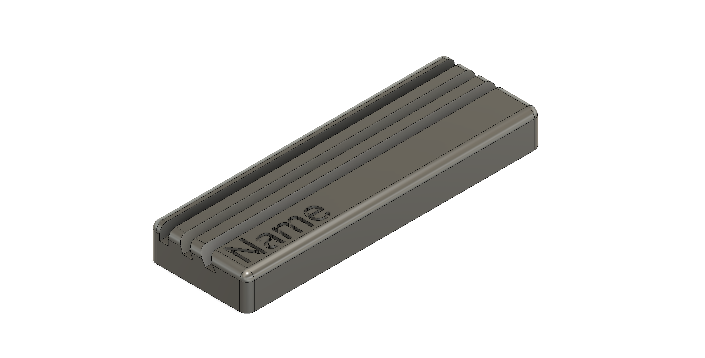

# TGL Board

### 8x16 ARGB LED Board

This project is a small low profile PCB LED matrix that can be used as a name tag
or to display various text and animations and to play games.

If you have your own "programmable" version,
you can read more about programming [here](#programming)

# About
This project was initially planned as a gift for teachers after our graduation.  
It is a small and low cost LED matrix board.  
It consists of a 8x16 ARGB LED matrix, two buttons as user input and a USB-C jack for powering and programming. 
On the front and backside there are several places where custom text can be written to,
to further individualize the board.  
One of the main goals was that the whole board is visually appealing
and can be used without an enclosure to have a simpler and sleeker looking product.

The electronics consist of an RP2040 microcontroller and a 2 MB (16 Mbit) flash IC.  
You can read more about the electronic [here](#hardware)

To program the board,
you can use SWD on the Tag-Connect connector on the backside as well as on the [custom pads on the backside](#swd-interface).  
It is also possible to program the board over USB-C,
but this needs further hardware modifications (Read more about [here](#usb-c))

# Software
Currently, the software has four modes:

- Displaying text
- Showing animations
- Playing a game
- Setting the brightness

Between these modes, you can easily switch by holding down both buttons at the same time and waiting a bit.
You can choose the mode by going left or right and select it by either waiting or pressing both buttons again.

Inside the different modes, the two buttons have different meanings.
They change the text, the color of the text, the animation, or you can play the game.

## Text
The text can be individually programmed by modifying the [board_text_config.h](src/DisplayText/board_text_config.h) file.

## Animations
There are currently seven different animations:

- Fireworks
- Snake "AI"
- Conway's Game of Life
- Meteorite rain
- Smooth rainbow
- 'Hard' rainbow
- Jumping 'thing'

## Games
There are also two games, but only one is selected by default.

- Dino Game (Default)
- Tetris

To change the game, you need to modify [main.cpp](src/main.cpp).

### Controls: 
#### Dino Game: 
**Left**: *Duck*  
**Right**: *Jump*

After each game, your score and your high score is shown.

#### Tetris:
**Left**: *Moves block to the left*  
**Right**: *Moves block to the right*  
**Right while holding left**: *Rotating block*

After each game, your score and your high score is shown.  
This Tetris game was created by @StarMiner99

## Brightness control
The brightness is only saved when you switch the menu after setting the desired brightness.

# Programming
You can either use PlatformIO (Arduino Framework) or the official C/C++ SDK from Raspberry Pi.  
If you want to use the C/C++ SDK, please use the c-SDK branch.

For details on how these two differ, read [Runtime](README_runtime.md).

## Usage

You need PlatformIO to use this project.  
Arduino IDE might work too (not tested).

In the platform.ini file, there are now two build environments.
`pico_normal` and `pico_fast` you can read about the differences here [Runtime](README_runtime.md).  

For your own programming, you can use my pioMatrixOutput library.
Documentation is here [pioMatrixOutput](READMEpioMatrixOutput.md).

For your own text, you can use my library.
Documentation is here [Textcontroller](README_textController.md).

For flash usage, read here [Flash](README_flash.md).

**Important:**
If you brick your board (can't upload anything) please read [here](README_bricked.md).  

# Hardware

Schematic, layout, BOM and gerber files can be found [here](hardware).  

Each button has a 10k-ohm pull-down resistor and a 100-nF capacitor for debouncing.  

The design of the MCU section follows more or less the [hardware design guide for the RP2040](https://datasheets.raspberrypi.com/rp2040/hardware-design-with-rp2040.pdf).

Because of the design,
it was not possible to add a 100-nF capacitor to each LED, but each row of LEDs (16 each) has its own 10-uF cap
(I know it is not perfect or a replacement).  
Also,
there are multiple more capacitors to further decouple the matrix as good as possible
so that fast-changing patterns do not affect the MCU and its operations.  
This is further improved by the fact the whole MCU subsystem runs on 3.3V over a LDO and not the 5.0V that the LEDs run on. 
While testing, I haven't had any issues with noisy power lines.  
Also, when measuring with my oscilloscope and the matrix turning fully on and fully off as fast as possible, 
I couldn't measure any serious noise on the 5.0V rail nor on the 3.3V rail for the MCU.

## USB-C
Behind the USB-C jack, there are two unpopulated pads.
These pads cut the USB data signal, so that you can't program the board over USB.  
This can be useful, for example,
if you do not want that your teachers get confused when they plug it in to their pc :^)  
If you want to enable USB programming,
you need to short these two pads either with an 0402 0-ohm resistor or simply with solder bridges.  
Be aware that this is quite challenging to solder, you shouldn't destroy/desolder neighboring components.  
Maybe it is easier if you use a hotplate and 0-ohm resistors (Haven't tried it).  
If you order new boards, you can add those to be assembled too.  
The 27-ohm resistors on each USB data line necessary for the RP2040 are already assembled.

It should look something like this:

## SWD interface
The three unnamed pads on the backside above the UART pads are connections for SWD programming. 

Pinout:
<pre>
board outline
 |
 |          +---+            +---+           +---+
 |         /     \          /     \         /     \
 |        /       \        /       \       /       \
 |       +   RUN   +      +   SWD   +     +  SWCLK  +
 |        \       /        \       /       \       /
 |         \     /          \     /         \     /
 |          +---+            +---+           +---+
 |
 |                  +---+            +---+          
 |                 /     \          /     \ 
 |                /       \        /       \
 |               +   Tx    +      +   Rx    +
 |                \       /        \       /       
 |                 \     /          \     /   
 |                  +---+            +---+
</pre>

# Stand
I also created a stand for the board.
It has three different angles: 90°, 70° and 60°.  
It has place for a name on the top side and for text on the bottom side.  
Inside the stand there are three slots for 1 cent coins (EU) to make the stand more stable.  
If you want to insert those coins, you need to stop the print mid-way and insert/glue the coins in place.  
3mf and STL files can be found [here](hardware/Stand)

If you have any questions, please contact me.

© 2024 Leonhard Baschang
